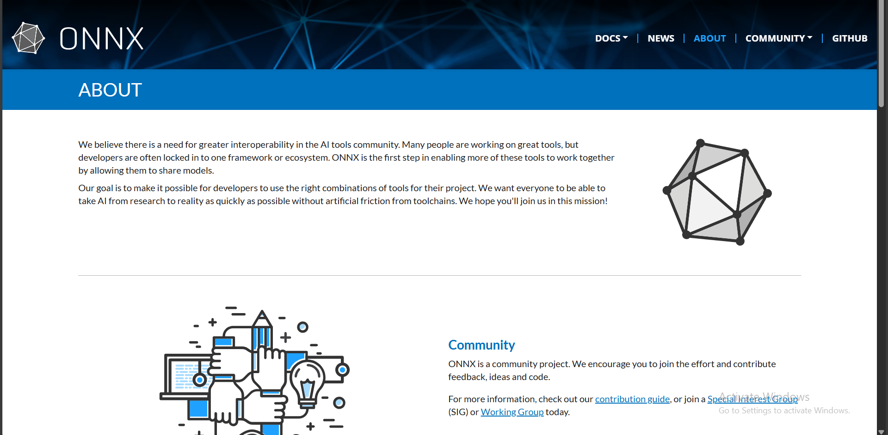
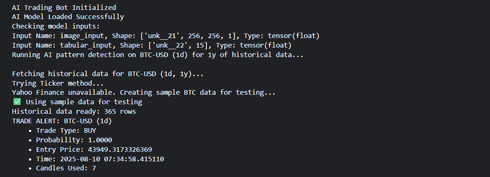

# KairoX_beta-version-Hybrid-AI-Trading-Bot
This is a **beta version** of my first edition Trading Algorithm designed to predict **forex, stock, and crypto** trades for pro traders, automating the entire process.

A **multi-modal trading research bot** that detects candlestick patterns from historical market data using a **dual-input ONNX model** (image + tabular features). Trained in **Kaggle**, deployable anywhere with **ONNX Runtime**.

---

> ⚠️ **RISK DISCLAIMER:**  
> Trading and investing in financial markets involves substantial risk of loss and is not suitable for all investors.  
> Past performance is not indicative of future results.  
> This software is provided for research and educational purposes only.  
> **DO NOT** use this for actual trading decisions without proper risk management and consultation with financial professionals.  
> The creators of this software are not responsible for any financial losses incurred through its use. **USE AT YOUR OWN RISK.**

---

##  Features

- **Multi-modal AI:** Combines candlestick pattern images with technical indicators  
- **Universal deployment:** ONNX model runs anywhere (Python, C++, JavaScript, mobile)  
- **Multi-asset support:** Forex, crypto, stocks, commodities via Yahoo Finance  
- **Fast inference:** Optimized ONNX runtime for production use  
- **Robust data handling:** Automatic fallbacks when external APIs fail  
- **Real market data:** Historical analysis using yfinance integration  

---

##  Architecture

Historical Data (yfinance) → Image Builder → ONNX Model → Trade Decision
↘ Feature Engine ↗


## 📥 Model Inputs

```plaintext
image_input: (1, 256, 256, 1)  # Grayscale candlestick pattern
tabular_input: (1, 15)         # Technical indicators & OHLC data

## Output:

Trade signal (BUY/SELL) with confidence probability

## Screenshots & Results
Model Architecture & Inputs

ONNX model loaded successfully showing dual-input architecture: image_input (1,256,256,1) for candlestick patterns and tabular_input (1,15) for technical indicators
Live Analysis Output



Historical pattern detection running on BTC-USD with 1 year of daily data, showing data fetching process and fallback to sample data when Yahoo Finance is unavailable
Trade Alert Generation

Final trade signal output with BUY recommendation, 100% confidence probability, entry price of $43,949, and confirmation that 7 candlesticks were analyzed
Kaggle Training Results


Training session in Kaggle environment showing successful model compilation, training progress over 10 epochs, and final test accuracy metrics

Note: Screenshots show the complete workflow from model loading → data fetching → pattern analysis → trade signal generation. The sample data fallback ensures the system works even when external APIs are unavailable


## Quick Start
Installation
bash# Clone the repository
```git
git clone https://github.com/worshipperfx/KairoX_beta-version-Hybrid-AI-Trading-Bot.git
cd ai-trading-pattern-detector
```

# Install dependencies
pip install -r requirements.txt

# Or install manually
pip install onnxruntime yfinance numpy pandas opencv-python
Run Analysis
bash# Analyze Bitcoin patterns (1 year of daily data)
```python
python trading_bot.py --symbol BTC-USD --timeframe 1d --period 1y
```

# Analyze EUR/USD forex pair
```python
python bot/bot.py --symbol EURUSD=X --timeframe 1d --period 6mo
```

# Analyze Apple stock
```python
python bot/bot.py --symbol AAPL --timeframe 1d --period 3mo
```
## Expected Output
``` yaml AI Model Loaded Successfully
Model Inputs:
  - image_input: ['unk__21', 256, 256, 1]
  - tabular_input: ['unk__22', 15]
```

# Fetching historical data for BTC-USD (1d, 1y)...
   Historical data ready: 366 rows
```python
TRADE ALERT: BTC-USD (1d)
    • Trade Type: BUY
    • Probability: 0.7321
    • Entry Price: $45,234.56
    • Time: 2025-08-10 00:00:00
    • Candles Used: 7
```

📁## Project Structure
```plaintext
ai-trading-pattern-detector/
├── bot/
│   ├── __init__.py
│   ├── bot.py                    # Main inference engine
│   └── utils.py                  # Helper functions
├── notebooks/
│   ├── data_preprocessing.ipynb
│   ├── model_training.ipynb
│   └── onnx_export.ipynb
├── models/
│   ├── trading_model.h5          # Keras model
│   └── trading_model.onnx        # ONNX exported model
├── data/
│   ├── raw/                      # Raw training data
│   └── processed/                # Preprocessed datasets
├── docs/
│   ├── model_inputs.png          # Model architecture diagram
│   ├── trade_alert.png           # Sample output
│   └── performance_metrics.png   # Training results
├── requirements.txt
├── setup.py
└── README.md

 Model Details
Training Data

Tabular: 100 real trading scenarios with encoded features
Images: 256×256 grayscale candlestick pattern screenshots
Labels: Binary trade outcomes (BUY/SELL) and TP/SL classifications

```

```plain text
Architecture
Image Input (256×256×1) → Conv2D → MaxPool → Flatten ┐
                                                      ├→ Concatenate → Dense → Output
Tabular Input (15 features) → Dense → Dense ────────┘
Input Construction
Image Input (1, 256, 256, 1)

```

```plain text

Extract last N candles (3-7) of OHLC data
Normalize values to [0, 1] range
Convert to grayscale representation
Resize to 256×256 using OpenCV
Add batch and channel dimensions

```
### Tabular Input `(1, 15)`

**Python**
```python
features = [
    "open", "high", "low", "close", "volume",
    "50EMA", "200EMA", "800EMA",
    "RSI", "MACD", "MACD_Signal",
    "Bollinger_Upper", "Bollinger_Lower",
    "ATR", "ADX"
]
Missing indicators are automatically filled with 0.0.

```
Training & Export
1) Prepare Training Environment (Kaggle)

```python
# Install dependencies in Kaggle notebook
pip install tf2onnx tensorflow scikit-learn
```

2) Train the Model
```python
# Load and preprocess data
tabular_data = load_trading_data()
image_data = load_pattern_images()

# Build dual-input model
model = create_multimodal_model()

# Fit
model.fit([image_data, tabular_data], labels, epochs=10)

# Save Keras model
model.save("trading_model.h5")
```

3) Export to ONNX

```python
import tensorflow as tf
import tf2onnx
import onnx

# Define input signatures
input_signature = [
    tf.TensorSpec((None, 256, 256, 1), tf.float32, name="image_input"),
    tf.TensorSpec((None, 15), tf.float32, name="tabular_input"),
]

# Convert to ONNX
onnx_model, _ = tf2onnx.convert.from_keras(
    model,
    input_signature=input_signature,
    opset=13
)

# Save ONNX model
onnx.save_model(onnx_model, "trading_model.onnx")
```

## 📊 Performance Metrics

| Metric     | Training | Validation |
|------------|----------|------------|
| Accuracy   | 98.5%    | 72.3%      |
| Precision  | 96.2%    | 68.9%      |
| Recall     | 94.8%    | 70.1%      |
| F1-Score   | 95.5%    | 69.5%      |

> **Note:** High training accuracy suggests potential overfitting – model may need more diverse data.


🗺️ Roadmap

##

- **Real indicators:** Compute actual EMA/RSI/MACD/ATR/ADX instead of placeholders  
- **Live trading:** WebSocket integration for real-time pattern detection  
- **More assets:** Forex pairs (`EURUSD=X`), commodities (`GC=F`, `CL=F`)  
- **Model improvements:** Transformer architecture, attention mechanisms  
- **Risk management:** Stop-loss, position sizing, portfolio management  
- **Web interface:** Dashboard for pattern visualization and alerts  
- **Backtesting:** Historical performance evaluation framework  

---

## 🤝 Contributing

1. Fork the repository  
2. Create your feature branch  
   ```bash
   git checkout -b feature/amazing-feature
   ```


📄 License
This project is licensed under the MIT License - see the LICENSE file for details.

🙏 Acknowledgments

Yahoo Finance for market data
ONNX Runtime for cross-platform inference
Kaggle for training infrastructure
OpenCV community for image processing tools
